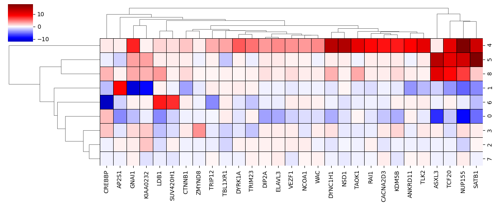

# cshift

A tool to perform cluster enrichment/depletion analyses



## Background

This is a tool to perform cluster enrichment/depletions with known groups.
It was built with single-cell perturbation studies in mind to answer the question
of how each perturbation potentially shifts leiden cluster occupation when compared
to non-targeting controls.

## Method

This performs a chi-square test for each group/cluster in the provided dataset.
Specifically, a chi-square test is performed for each group and cluster between
each group distribution and each non-targeting control distribution.
The pvalues from this are then aggregated over the non-targeting controls using
a geometric mean.
Finally these pvalues are adjusted for multiple hypothesis testing using a
Benjamini Hochberg correction.

## Usage

### Toy Dataset

Here is an example starting from scratch

``` python
import numpy as np
from cshift import CShift

# define your array of clusters
clusters = np.array([0, 0, 0, 1, 1, 1])

# define your array of groups
groups = np.array([0, 1, 2, 0, 1, 2])

# define your reference group (this is what we are comparing everything against)
reference = np.array([0])

# create the CShift object
cs = CShift(
    clusters,
    groups,
    reference,
)

# perform all the chi-square tests and calculate the percent change
# and false discovery matrix
pcc, qval = cs.fit()
assert pcc.shape == (3, 2)
assert qval.shape == (3, 2)

# plot the signed negative log adjusted p-values as a clustermap
# this is commented out because there will not be any enrichment/depletions
# cs.plot()
```

### With Single Cell Sequencing

Here is an example of what it would be like in context of single-cell analysis

``` python
from cshift import CShift

# adata is an AnnData object used in scanpy
cs = CShift(
    clusters=adata.obs.leiden.values,
    groups=adata.obs.guide_name.values,
    reference=np.array(["NTC_5406", "NTC_5408", "NTC_5412", "NTC_5430"])
)
pcc, qval = cs.fit()

cs.plot()
```
